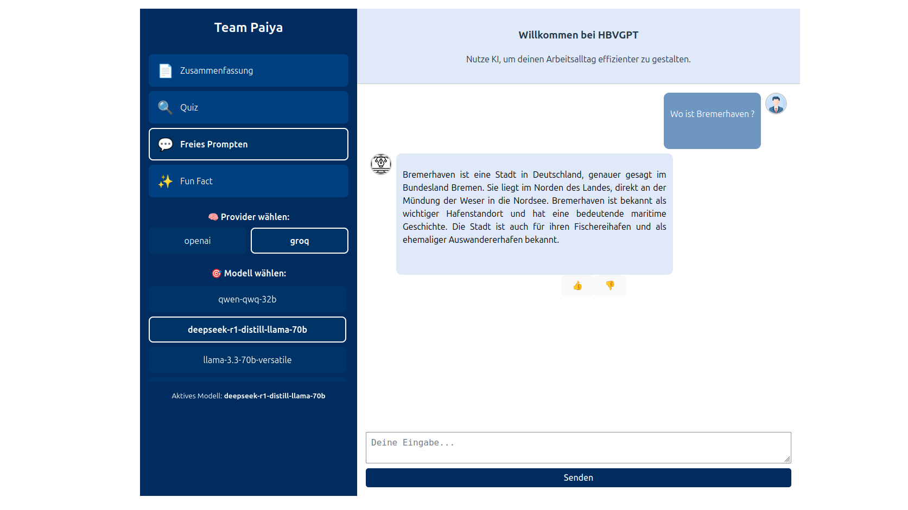

# 🧠 HBVGPT – Your Smart AI Assistant for Everyday Work

**HBVGPT** is a modern chat interface powered by various Large Language Models (LLMs), designed to help you handle everyday tasks more efficiently – from summarizing texts and generating quizzes to open-ended prompting and retrieving interesting facts with citations.

---

## 🚀 Features

### 💼 Use Cases
Choose from different intelligent use cases:
- 📄 **Summarization**: Condense texts into short, medium, or long summaries.
- 🔍 **Quiz**: Automatically generate quiz questions based on a chosen topic.
- 💬 **Free Prompting**: Ask open-ended questions or submit your own prompts.
- ✨ **Fun Fact**: Receive interesting, cited facts on various topics.

### ⚙️ Model & Provider Selection
- Select from various AI providers (e.g., `groq`, `openai`).
- Use top-tier models like `gpt-4o`, `llama3`, `gemma2-9b-it`, and more.

### 🔁 Conversational Context
- The assistant maintains context across recent interactions (up to 10 messages).
- Chat history is visually displayed with avatars for clarity.

### ✅ Feedback System
- Rate individual responses with thumbs up/down.
- After several messages, a general satisfaction prompt appears.

---

## 🧑‍💻 Local Development

### 📦 Requirements

- **Docker**: [https://www.docker.com](https://www.docker.com)
- **Docker Compose**: Comes bundled with Docker Desktop
- **Node.js (optional)**: [https://nodejs.org](https://nodejs.org) – only required if developing frontend without Docker
- **Python 3.11**
- **API access to LLM providers**, e.g.:
  - [OpenAI](https://platform.openai.com/)
  - [Groq](https://console.groq.com/)

### ⚙️ Start with Docker

```bash
docker-compose up --build
```

The services will be available at:
- Frontend: [http://localhost:3033](http://localhost:3033)
- Backend API: [http://localhost:8033/api/process_query](http://localhost:8033/api/process_query)

---

## 📁 Project Structure

```
.
├── Dockerfile.fastapi        # Backend (FastAPI)
├── chat/
│   ├── Dockerfile            # Frontend (Vite/Vue)
│   ├── src/                  # Vue components
│   └── ...
├── requirements.txt          # Backend dependencies
├── main.py                   # FastAPI entry point
├── docker-compose.yml        # Services & network
└── README.md                 # Project documentation
```

---

## 🔐 .env File

Place a `.env` file in the project root for API configuration. Example:

```env
OPENAI_API_KEY=sk-...
GROQ_API_KEY=...
```

---

## 🧠 API Endpoints

### POST `/api/process_query`

**Description**: Responds to user queries based on the selected use case.

**Body:**

```json
{
  "query": "What is quantum physics?",
  "use_case": "FunFact",
  "length": "short",
  "provider": "groq",
  "model": "gemma2-9b-it",
  "messages": [ { "role": "user", "content": "..." } ]
}
```

---

### POST `/api/store_feedback`

**Description**: Saves user feedback (thumbs up/down) for each message in opensearch.

---

## 🌍 Technologies Used

- **Frontend**: Vue 3, Vite, Markdown Rendering (Marked + DOMPurify)
- **Backend**: FastAPI, Python 3.11
- **Containerization**: Docker & Docker Compose
- **Styling**: Custom responsive CSS
- **LLM APIs**: OpenAI, Groq
- **Additional Tools**: LangChain, LLaMA, OpenSearch

---

## 💡 Example Interaction




---

## 📚 External Documentation & Resources

Here are useful links to the technologies and platforms integrated with HBVGPT:

- **OpenAI API Docs** → [https://platform.openai.com/docs](https://platform.openai.com/docs)
- **Groq API Docs** → [https://console.groq.com/docs](https://console.groq.com/docs)
- **LangChain Documentation** → [https://docs.langchain.com](https://docs.langchain.com)
- **OpenSearch Documentation** → [https://opensearch.org/docs/latest](https://opensearch.org/docs/latest)
- **LLaMA Prompting Guide** → [https://www.llama.com/docs/how-to-guides/prompting/#reduce-hallucinations](https://www.llama.com/docs/how-to-guides/prompting/#reduce-hallucinations)

These resources help you understand how prompting, model selection, and integration logic can be optimized for better performance and reliability when working with LLMs.

---


## 📣 Contributing

Pull requests are welcome! If you'd like to add new use cases or model providers, feel free to open an issue or fork the repo and contribute 🚀

---

## 🧾 License

This project is released into the public domain under The Unlicense. See the LICENSE file for details.